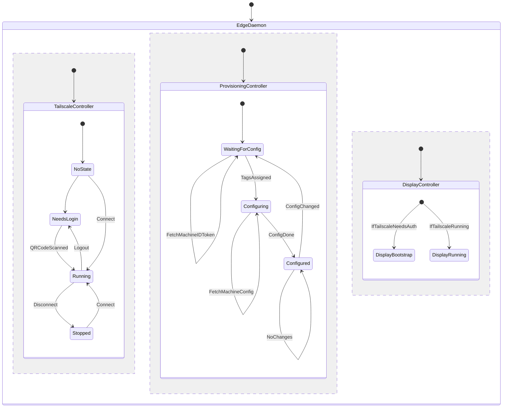

# edged
Edge daemon for running on edge nodes deployed by jtcressy-home

## Controller Design

### TailscaleController
The TailscaleController will be responsible for managing the Tailscale daemon connection state, such as assisting with
bootstrapping by triggering the interactive login flow to maintain a fresh authentication URL until an operator bootstraps
the machine with Tailscale control/admin panel.

### ProvisioningController
The ProvisioningController will be responsible for configuring the device based on the devices tags from the Tailscale
admin panel. The tags basically act as roles for the device to assume, such as k8s master, k8s worker and so on. It is
not yet determined what tools will be used to complete configuration or bootstrap kubernetes. This is a work-in-progress.

### DisplayController
The DisplayController is responsible for managing various display methods for reporting the status of the Tailscale and
Provisioning controllers. It is intended to control a handful of physical displays depending on device type.

Currently, it is in the roadmap to support the following display types:
- TUI via tty0 (replaces standard getty login prompt on linux)
- SSD1306 OLED display via i2c
- HD44780 LCD display via i2c (either 16x2 or 20x4)

The Auth URL exposed by Tailscale will be displayed as a QR code when possible, or standard shortened text URL otherwise.